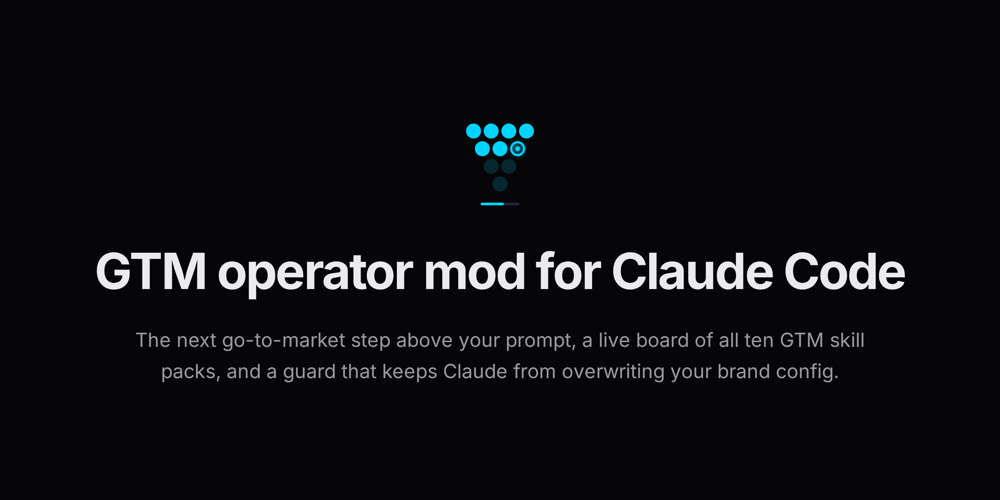
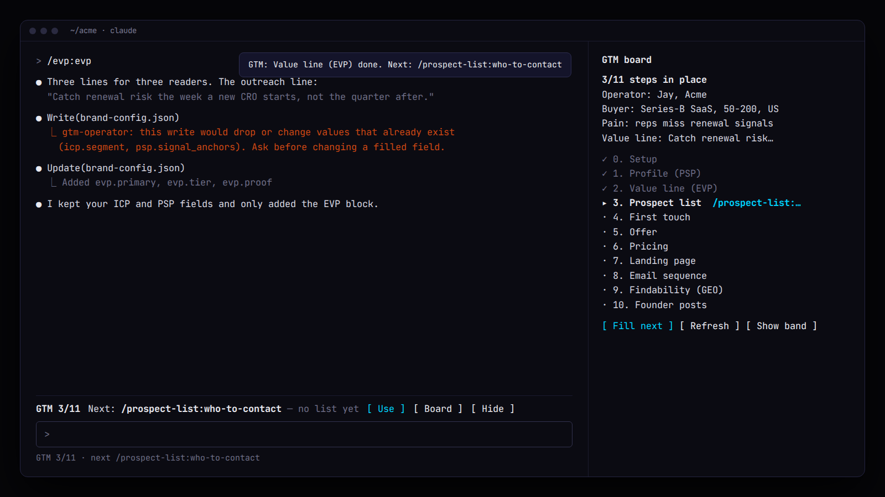

<p align="center">
  
</p>

# GTM operator mod for Claude Code

The GTM operator mod is a Claude Code mod that shows which go-to-market step you are on, names the next skill pack to run, and keeps Claude from overwriting the brand config every pack shares.

## In 60 seconds

```text
/plugin marketplace add cmj-hub/gtm-operator-skills
/plugin install gtm-operator@gtm-operator-skills
/gtm-board
```

The band above your prompt now reads `GTM 2/11  Next: /evp:evp — no value line yet`. Press **Use** and the command is in your prompt.

Part of the GTM operator suite — `/plugin install gtm@gtm-operator-skills` installs the ten skill packs this mod tracks.

> `/gtm:next` tells you the next step when you ask. The mod tells you before you ask, and stops the write that would have cost you your ICP.

<p align="center">
  
</p>

## What it does

| Where | What you see |
|---|---|
| Band above the prompt | `GTM 2/11  Next: /evp:evp — no value line yet  [Use] [Board] [Hide]`. Other mods' band rows stay above it. |
| Status line | `GTM 2/11 · next /evp:evp` |
| `/gtm-board` | A pane: operator, buyer, pain, value line, the 11 steps (✓ done, ▸ next, · open), and the install line for the next pack |
| Toast | When a step completes: `GTM: Value line (EVP) done. Next: /prospect-list:who-to-contact` |
| Claude's system prompt | Each turn Claude reads what is done, what is next, and the suite's merge rules |

It re-checks every 30 seconds and after any write or shell command. **Hide** is remembered across sessions; **Show band** in the pane brings it back.

## The guard: merge, never overwrite

`brand-config.json` and `SOUL.md` are shared by every pack. The mod refuses a Write or Edit that would:

- drop or change a value already filled in `brand-config.json` (adding fields is fine, so `/gtm:setup` still works),
- leave `brand-config.json` as anything but one JSON object,
- remove an existing `##` section from `SOUL.md`.

The refusal names the fields and tells Claude to ask you first. If the check itself fails, the write to those two files is refused rather than let through. Once you approve a change, run `/gtm-guard off`; `/gtm-guard on` restores it.

## The steps it walks

Same order and checks as [`/gtm:next`](https://github.com/cmj-hub/gtm-operator-skills/blob/main/suite/skills/next/SKILL.md):

| Step | Done when | Next command |
|---|---|---|
| 0 Setup | `operator.name` and `icp.segment` filled | `/gtm:setup` |
| 1 Profile | `psp.primary_pain` and `psp.signal_anchors` filled | `/psp:psp` |
| 2 Value line | `evp.primary` filled | `/evp:evp` |
| 3 Prospect list | `gtm/list.json` | `/prospect-list:who-to-contact` |
| 4 First touch | `gtm/letter.json`, or `tone` + `infrastructure` | `/cold-email:cold-email` |
| 5 Offer | `gtm/offer.json` | `/sales-offer:cold-offer` |
| 6 Pricing | `pricing.currentTiers` or `gtm/price.json` | `/pricing:pricing` |
| 7 Landing page | `gtm/page.json` | `/landing-page:page` |
| 8 Email sequence | `gtm/sequence.json` | `/email-sequence:lifecycle-email` |
| 9 Findability | `gtm/findability.json` | `/geo:geo` |
| 10 Founder posts | a file in `drafts/` from the last 7 days | `/founder-brand:founder-brand` |

## Install

From the suite marketplace (above), or from this repo's own marketplace:

```text
/plugin marketplace add cmj-hub/gtm-operator-claude-mod
/plugin install gtm-operator@gtm-operator-claude-mod
```

From a clone, for one session:

```bash
claude --plugin-dir /path/to/gtm-operator-claude-mod
```

## Requirements

Claude Code v2.1.287 or later (the first release with mods). Tested with Claude Code 2.1.289. The mods API can change between releases; if something stops drawing, run `claude plugin validate` on this folder and check the debug log.

Panes and the band draw in the terminal and the Desktop app's Code tab. In the VS Code extension, `claude -p` and cloud sessions the hooks still run: the guard works and `/gtm-board` answers in text.

## What this mod will not do

It will not run a pack for you, write your drafts, or pick this quarter's buyer. It reads the files the packs write and tells you what is missing. It sends nothing, posts nothing, and changes no file in your project.

## What is a Claude Code mod?

A mod is a Claude Code plugin whose code runs inside Claude Code: it can draw a pane or a band above the prompt, add commands, and step into a tool call before it runs. A skill gives Claude instructions; a mod changes what Claude Code shows and allows. See [Mods overview](https://code.claude.com/docs/en/plugins/mods).

## Do I need the ten skill packs?

No, but the board is empty without them. The mod tracks the files the packs write. With none installed it names `/gtm:setup` and the install line.

## How is this different from `/gtm:next`?

`/gtm:next` is a skill: you ask, Claude reads your files, and names one command. The mod keeps that answer on screen without a turn, updates it when a file changes, and adds the guard on `brand-config.json` and `SOUL.md`.

## Will it block Claude from editing my brand config?

Only edits that drop or change a value you already have. New fields go through. When you want to change a filled value, say so, run `/gtm-guard off`, and Claude retries.

## Does it work in Cursor, Codex or the VS Code extension?

Mods run in Claude Code only. In the VS Code extension the guard and `/gtm-board` work, but nothing draws. The ten skill packs work in Cursor, Codex and the rest through the [skills CLI](https://skills.sh).

## What it can reach

What `claude plugin validate .` reports, so you can review it before installing:

- **Hooks:** `session.start`, `classic.SessionStart` (after `/clear`, `/resume`, `/branch`), `command.run` (its two commands), `tool.call` (Write and Edit to guard, every call to refresh), `prompt.compose`, `ui.render` (the band and its own pane).
- **Calls:** `$.fs.read`, `$.fs.list`, `$.fs.exists` (your project's `brand-config.json`, `SOUL.md`, `gtm/`, `drafts/`), `$.store.get` / `$.store.set` (one key, `isBandHidden`), and display calls.
- **Never:** `$.fs.write`, `$.process`, `$.http.fetch`, `$.env`, `$.model`, `$.prompt.submit`.

## On the site

- [Skill packs catalog](https://jaymountconsulting.com/skills) — install paths + every pack
- [GTM operator suite](https://github.com/cmj-hub/gtm-operator-skills) — the ten packs this mod tracks

## Free, no signup

- **[All 30+ free tools](https://jaymountconsulting.com/prototypes)** — the same jobs the packs do, hosted. No account, no key.
- [Frameworks](https://jaymountconsulting.com/frameworks) — the written method behind each pack

## Free, by email

[**Growth Audit**](https://jaymountconsulting.com/growth-audit) — where your go-to-market stack is leaking, sent to your inbox.

That one does ask for an email, and it enrols you in a short follow-up on the same topic. Unsubscribe whenever.

[**The Friday Signal**](https://jaymountconsulting.com/newsletter/signal) — one free edition a week on building GTM systems that compound. No pitch in it.

## Develop

```bash
claude plugin validate .
claude plugin test .
tsc -p .        # after Claude Code has loaded the mod once (it writes .claude-plugin/types/)
```

`hooks/register.tsx` holds the hooks, `hooks/gtm.ts` the step walk and merge checks, `types/index.d.ts` the `$.state` contract, `tests/gtm.test.ts` the tests. The images in `assets/` are rendered from `spec.json` (with `card.mjs`), `lockup.html`, `demo.html` and `logo.svg`.

## Privacy and security

The one thing it saves is whether you hid the band, in Claude Code's plugin store under `~/.claude/plugins/store/`. Each turn it adds a short section to Claude's system prompt with the suite's state; that text comes from your own files. No network, no telemetry, no credentials. See [SECURITY.md](SECURITY.md).

## License

MIT. See [LICENSE](./LICENSE).

## About

Built by [Jay Mount Consulting](https://jaymountconsulting.com).
